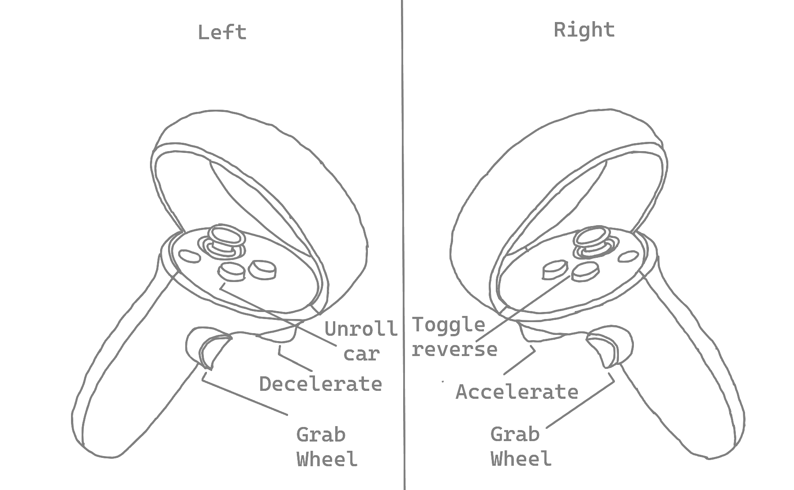

<h1 style = "text-align: center"> VRACING</h1>

 
A VR racing game developed for a VR class for the Meta Quest 2

Installation
---

NOTE: Unity 2023.1.01f was used for development with android SDK installed to build to the Meta Quest 2 headset.

1. Clone the repository using:
    >git clone https://github.com/CreamWithIce/VRacing.git

1. Install unity 2023.1.01f (or check your unity version will work) with the android SDK

1. Enable developer mode on the Meta Quest 2 by following: [The developer mode setup](https://developer.oculus.com/documentation/native/android/mobile-device-setup/)
to be able to build to the Meta Quest 2

1. OPTIONAL: Install the quest app from:
[The Oculus software](https://www.meta.com/au/quest/setup/)
if you want to run VRacing directly in the editor (Check PC specs!)

Setup
---

1.  Open the repository up in Unity after installing the correct version and android platform

1. Check correct build settings are applied by:
    - Selecting android build is selected through: \
    File > Build settings > Android > Switch platform (if it is not selected)

    - Ensure that the oculus plugin is enabled: \
    Edit > Project settings > XR-Plugin management > Android logo > Enable oculus check box

1. Connect Meta Quest 2 to PC/Laptop

1. Build and run the application

Controls
---

| Input | Action/purpose |
| ----- | -------------- |
| Grab wheel | Both hands required to turn the wheel |
| Decelerate | Makes the car brake |
| Accelerate | Moves car move forward|
| Unroll car | If the car rolls over, press this to righten it |
| Toggle reverse | Makes the wheels spin forward or backward if toggled |

License
---
MIT License

Copyright (c) [2023] [CreamWithIce]

Permission is hereby granted, free of charge, to any person obtaining a copy
of this software and associated documentation files (the "Software"), to deal
in the Software without restriction, including without limitation the rights
to use, copy, modify, merge, publish, distribute, sublicense, and/or sell
copies of the Software, and to permit persons to whom the Software is
furnished to do so, subject to the following conditions:

The above copyright notice and this permission notice shall be included in all
copies or substantial portions of the Software.

THE SOFTWARE IS PROVIDED "AS IS", WITHOUT WARRANTY OF ANY KIND, EXPRESS OR
IMPLIED, INCLUDING BUT NOT LIMITED TO THE WARRANTIES OF MERCHANTABILITY,
FITNESS FOR A PARTICULAR PURPOSE AND NONINFRINGEMENT. IN NO EVENT SHALL THE
AUTHORS OR COPYRIGHT HOLDERS BE LIABLE FOR ANY CLAIM, DAMAGES OR OTHER
LIABILITY, WHETHER IN AN ACTION OF CONTRACT, TORT OR OTHERWISE, ARISING FROM,
OUT OF OR IN CONNECTION WITH THE SOFTWARE OR THE USE OR OTHER DEALINGS IN THE
SOFTWARE.